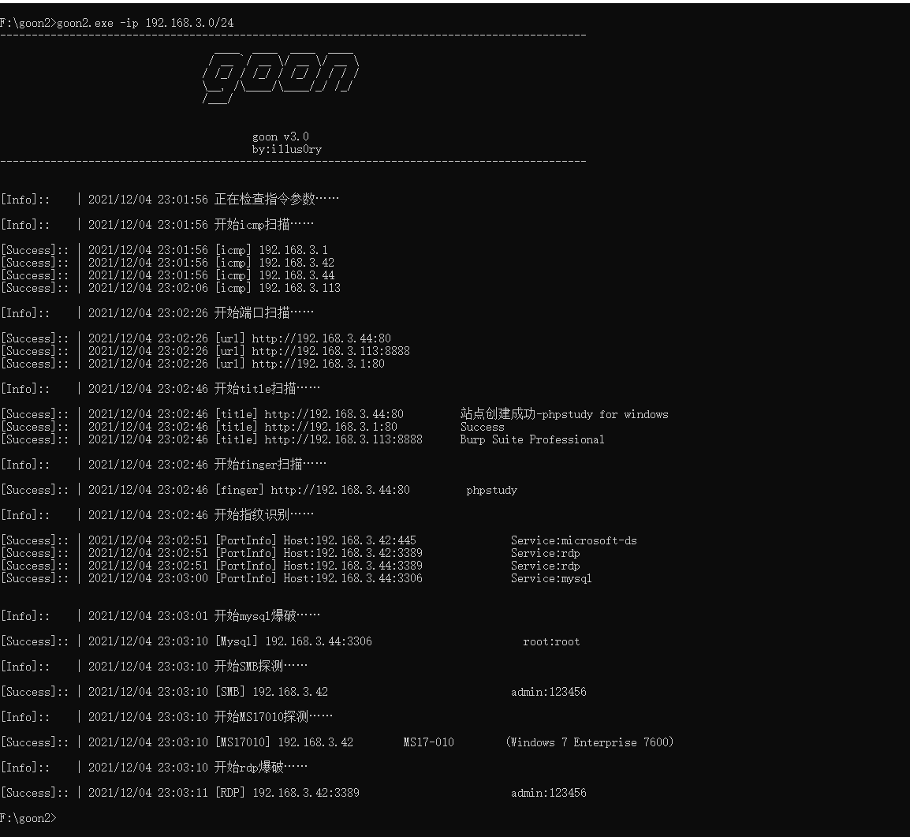
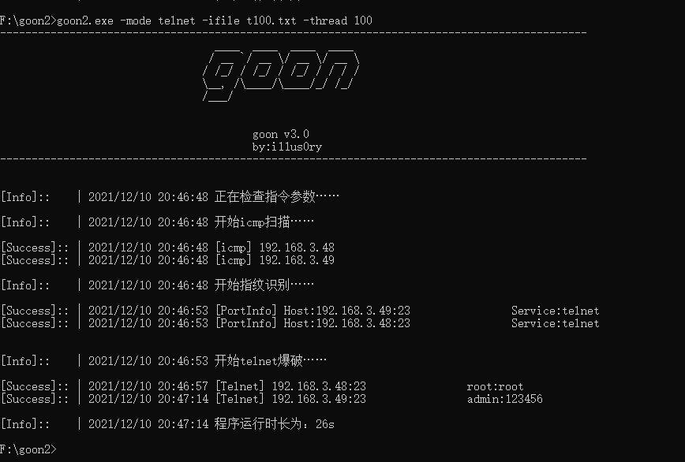
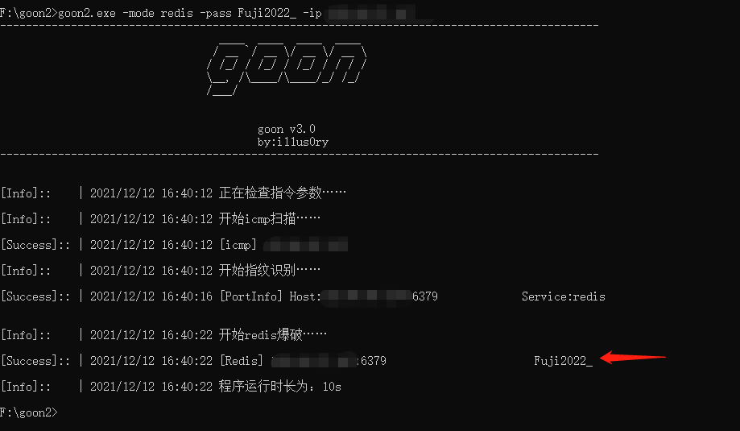
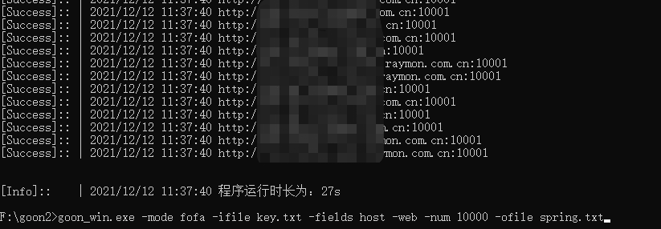
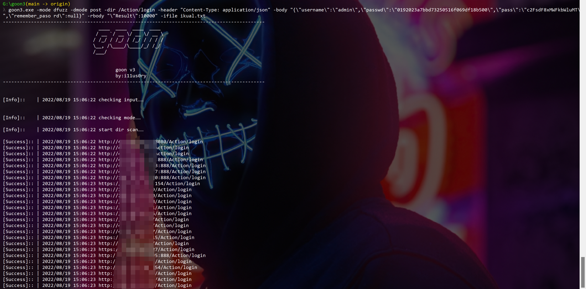
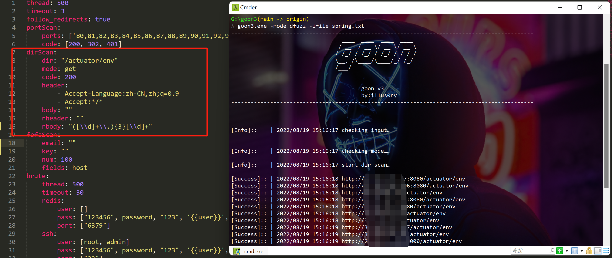

## 工具简介
```
---------------------------------------------------------------------------------------------
                                  ____  ____  ____  ____
                                 / __ `/ __ \/ __ \/ __ \
                                / /_/ / /_/ / /_/ / / / /
                                \__, /\____/\____/_/ /_/
                                /___/

                                        goon v3
                                        by:i11us0ry
---------------------------------------------------------------------------------------------

goon,集合了fscan和kscan等优秀工具功能的扫描爆破工具。
功能包含：ip探活、port扫描、web指纹扫描、title扫描、fofa获取、ms17010、mssql、mysql、postgres、redis、ssh、smb、rdp、telnet等爆破
以及如netbios探测等功能。

```

## 更新说明
- 2023年12月25日 v3.6
    - 新增 -ping 选项，调用ping探活ip，适用于非root/admin权限情况
    - 新增 -no 选项，不保存文件，适用于linux下报错open too many files
    - title、finger扫描可以直接输入domain和url
    - 爆破类支持输入ip、ip段和127.0.0.1:6379格式数据

- 2022年08月19日 v3.5
    - 端口指纹优化，不输出无关指纹
    - dir 扫描，升级为dfuzz，支持post发包，支持正则匹配结果，方便简易poc探测
    - ip 探活，做子网划分，支持/8-/31之间任意CIDR，/8-/15之间自动生成所有c段，先探测每个c段的.1;/16-/23之间自动生成所有c段，先探测每个c段的.1和.254，/24先探测.1和.24，/25-/31探测所有ip
    - title 扫描，加code显示、body长度
    - finger 探测，输出完整url

- 2022年07月31日 v3.4
    - dir扫描支持正则
    - 修复finger一些bug
    - 修复-ifile一些bug
    - 删除备份扫描功能

- 2022年03月01日 v3.3
   - 优化redis爆破出错问题
   - 优化netbios扫描超时问题
   - ip探活改为先探测.1和.255的方式
   - 日志输出改英文避免乱码

- 2022年02月21日 v3.2
   - 更新fofa接口，每次请求添加了0.5s的间隔

- 2021年12月13日 v3.1
   - 新增tomcat爆破

- 2021年12月10日 v3.0
   - 新增了很多功能，也重写了架构，虽然多多少少还有些许问题，但整体比以前好用了许多
   - rdp爆破模块用的开源的grdp
   - telnet爆破目前只做了win7和ubantu下的telnet服务，其他unix或嵌入式的还没测试
   - 所有爆破都不介意使用过多密码表测试

## 使用帮助

#### 编译说明：
- 只提供win、linux、mac下amd64的编译成品，若不能满足需求可自行编译。
- 关于自行编译可能遇到的问题和解决方案如下：

- 执行mysql爆破时日志打印如下信息：
`wsarecv: An existing connection was forcibly closed by the remote host.`
  - 解决方案：注释掉如下代码后重新编译（依赖问题）
`github.com/go-sql-driver/mysql/packets.go 中注释 errLog.Print(err) `

- 执行http请求时日志打印如下信息：
`Unsolicited response received on idle HTTP channel starting with`
  - 解决方案：注释掉如下代码后重新编译（依赖问题）
`net/http/transport.go 中 log.Printf("Unsolicited response received on idle HTTP channel starting with %q; err=%v", buf, peekErr)`

#### 其他说明
- 问题：linux下报错open too many files
  - 解决：参考https://blog.csdn.net/whatday/article/details/104166669（linux问题）
 
- 问题：goon执行直接报错，加上-np不报错
  - 解决：执行goon的权限太低

- 问题：乱七八糟的
  - 解决：提issues，我会尽快验证修复

#### 参数说明：

可选mode如下:
```
  all:    默认选项,包含ip-port(web)-title-finger-ftp-ms17010-mssql-mysql-postgres-redis-ssh-smb-rdp-telnet-netbios
  webscan:  包含ip-port(web)-title-finger
  brute:    包含ip-ftp-ms17010-mssql-mysql-postgres-redis-ssh-smb-rdp-telnet
  ip:   ip探活, 默认使用icmp，执行-ping使用ping，支持/8-/31之间任意CIDR，
        /8-/15之间自动生成所有c段，先探测每个c段的.1;
        /16-/23之间自动生成所有c段，先探测每个c段的.1和.254，
        /24先探测.1和.24，/25-/31探测所有ip
  port:   端口扫描,执行-web直接探测http/https
  fofa:   fofa资产获取,执行-web输出host时添加http(fields为多个时host放在最后一位)
  title:    title扫描
  finger:   web指纹探测
  dfuzz:    路径fuzz,适用于对批量url进行单个dir探测，支持post发包，支持正则匹配，可探测简单poc
  tomcat:   tomcat爆破，目标为url，如http://127.0.0.1:8080或http://127.0.0.1:8080/manager/html
  ftp:    ftp爆破,其他ms17010,mssql,mysql,postgres,redis,ssh,smb,rdp,telnet同理
  netbios:  netbios探测 
```

指令参考：
```
fofa:
  goon3.exe -mode fofa -ifile key.txt -fields host -num 1000 -web       # 从key.txt文件中获取语法并从fofa爬区结果，每条语法返回1000条url，且自带http和https
  goon3.exe -mode fofa -key port="8081" -fields ip                      # 从fofa获取语法为 port="8081" 的ip，数据量为配置文件中配置的数量

dfuzz:
  goon3.exe -mode dfuzz -dmode post -dir /Action/login -header "Content-Type: application/json" -body "{\"username\":\"admin\",\"passwd\":\"0192023a7bbd73250516f069df18b500\",\"pass\":\"c2FsdF8xMWFkbWluMT\ ",\"remember_paso rd\":null}" -rbody "\"Result\":10000" -ifile ikual.txt                                   # 从文件中读取资产并进行爆破，返回结果中存在"Result":10000表示爆破成功
  goon3.exe -mode dfuzz -ifile spring.txt                               # 从配置文件中读取规则fuzz spring未授权漏洞

brute:
  goon3.exe -mode brute -ip 192.168.0.0/16 -thread 100 -time 3                      # 对192.168.0.0/16进行爆破，线程100，超时3s
  goon3.exe -mode mysql -ip 192.168.0.0/18 -user root -pass root -ofile mysql.txt   # 对192.168.0.0/18进行mysql爆破，用户密码root:root，结果输出mysql.txt
  goon3.exe -mode mssql -ifile ip.txt -ufile user.txt -pfile pass.txt -np           # 从ip.txt读取ip进行mssql爆破且不进行探活，用户密码从文件中获取

scan:
  goon3.exe -mode webscan -ifile ip.txt                                             # 从ip.txt读取ip进行ip探活、端口扫描、title扫描和finger扫描
  goon3.exe -mode title -ifile ip.txt -np -thread 100                               # 从ip.txt读取ip进行端口扫码和title扫描，线程100
  goon3.exe -mode tomcat -ifile tomcat.txt -ufile user.txt -pfile pass.txt          # 从ip.txt读取url进行爆破，用户密码从文件中获取
```

## 示例截图

#### 默认情况

成果为一个go可执行文件和一个yaml配置文件，若无配置文件可以先运行goon生成默认配置文件



#### 单独调用telnet模块
这是更新telnet模块后的截图



#### 单独调用redis模块并指定密码



#### fofa模块批量获取资产



#### dfuzz模块探测使用post爆破ikuai云(非国内资产)



#### dfuzz模块探测使用正则探测spring未授权(非国内资产)

